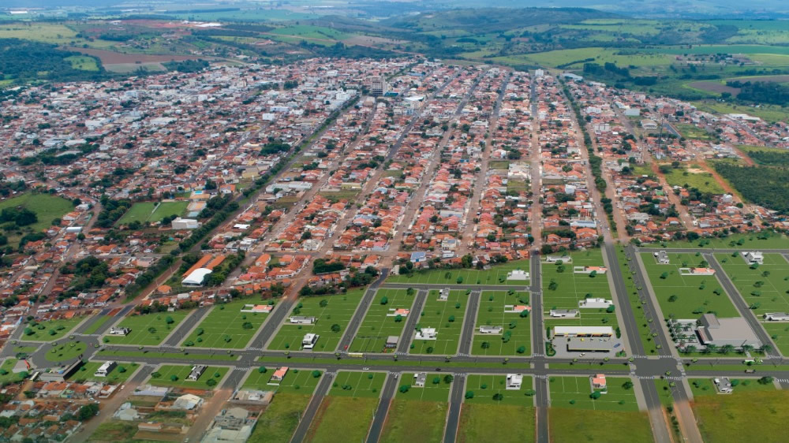

<div align="center">
  

  # Guia Turístico - Coromandel

  **Site informativo sobre pontos turísticos de Coromandel - MG**

  Uma página web simples, bonita e responsiva para apresentar atrativos turísticos, curiosidades locais e um formulário de contato sobre a cidade de Coromandel, Minas Gerais.

</div>

---

## Sobre o Projeto

Guia Turístico - Coromandel é um site estático desenvolvido para divulgar alguns dos principais encantos de Coromandel - MG. O projeto reúne uma página inicial, uma seção com pontos turísticos, curiosidades sobre a cidade e uma página de contato com validação de formulário em JavaScript.

### Principais Funcionalidades

- Página inicial com apresentação da cidade
- Listagem de pontos turísticos com imagens e descrições
- Seção de curiosidades sobre Coromandel
- Formulário de contato com validação de nome, e-mail e mensagem
- Simulação de envio de mensagem sem backend
- Navegação entre páginas por menu superior
- Layout responsivo para desktop e dispositivos móveis
- Estilização moderna com gradientes, cards e animações

---

## Tecnologias Utilizadas

### Frontend

- **HTML5** - Estrutura das páginas do site
- **CSS3** - Estilização, responsividade, animações e layout visual
- **JavaScript** - Validação e simulação de envio do formulário de contato
- **Google Fonts** - Fonte Poppins utilizada na interface

### Recursos Visuais

- Imagens locais dos pontos turísticos
- Gradientes no cabeçalho, rodapé e botões
- Cards para organização dos conteúdos
- Animações de entrada e efeitos de hover

### Infraestrutura

- Projeto estático, sem necessidade de backend
- Pode ser executado diretamente no navegador
- Compatível com Live Server no VS Code

---

## Estrutura do Projeto

```text
Guia-Turistico-Coromandel/
├── README.md
└── src/
    ├── css/
    │   └── style.css              # Estilos globais do site
    ├── fotos/                     # Imagens utilizadas nas páginas
    │   ├── foto-aabb.png
    │   ├── foto-cachoeiradosantuario.png
    │   ├── foto-coromandel.jpg
    │   └── foto-praca-abelferreira.png
    ├── pages/
    │   ├── pagina1.html           # Página inicial
    │   ├── pagina2.html           # Pontos turísticos
    │   ├── pagina3.html           # Curiosidades
    │   └── pagina4.html           # Contato
    └── script/
        └── script.js              # Validação do formulário
```

---

## Pontos Turísticos Apresentados

- **Praça Abel Ferreira** - Homenagem ao clarinetista e compositor nascido em Coromandel
- **Cachoeira do Santuário** - Atrativo natural com queda d'água e poço de águas cristalinas
- **Clube AABB Coromandel** - Espaço de lazer, convivência e atividades esportivas

---

## Características Técnicas

- **Design Responsivo**: adaptação visual para telas menores
- **Site Estático**: não depende de banco de dados ou servidor backend
- **Formulário Validado**: verificação de campos obrigatórios e formato de e-mail
- **Navegação Simples**: menu disponível nas páginas principais
- **Código Organizado**: separação entre páginas HTML, estilos CSS, scripts JS e imagens
- **Interface Moderna**: uso de sombras, bordas arredondadas, gradientes e transições

---

## Como Rodar o Projeto

### Abrindo diretamente no navegador

1. Abra a pasta do projeto
2. Acesse `src/pages/pagina1.html`
3. Abra o arquivo no navegador

### Usando Live Server no VS Code

1. Instale a extensão **Live Server**
2. Abra a pasta do projeto no VS Code
3. Navegue até `src/pages/pagina1.html`
4. Clique com o botão direito no arquivo
5. Selecione **Open with Live Server**

---

<div align="center">

Feito para apresentar os encantos de **Coromandel - MG**.

</div>
